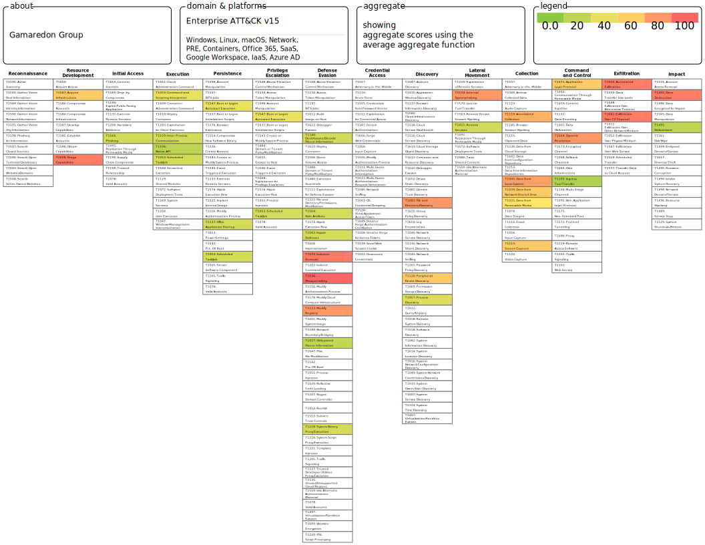

- [x] Вы – хакер находящийся в интернете, вам необходимо проникнуть внутрь инфраструктуры и скомпрометировать 2 цели. 1-ая компьютер глав буха компании 2-ая ноутбук системного администратора. Применяя матрицу Att&ck.

Работа с матрицей Mittre

---

- [ ] Разработать план защиты и план реагирования на атаку, которую вы провели гипотетически в предыдущем задании. Используя матрицы D3fence и Re&ct
      p.s. У вас есть базы данных, AD DC, Cisco ASA, FTP / NFC servers, Wi-Fi routers, Web server ISS/ Nginx, внешние и внутренние ресурсы
