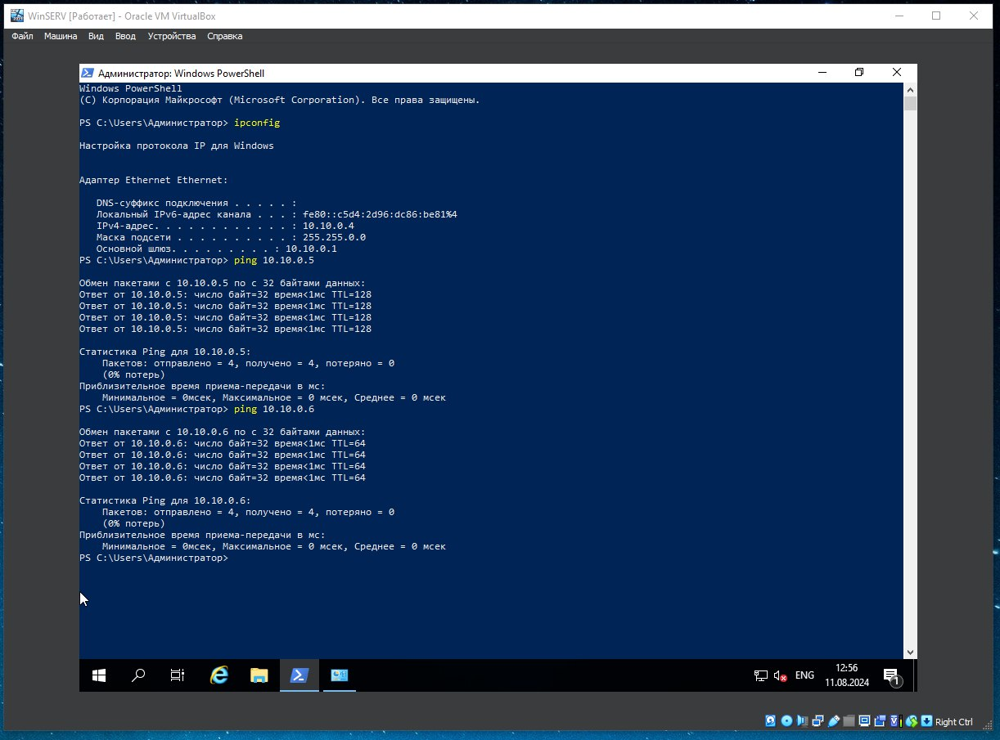

# Homework

- [x] Установить ОС с образа \*.iso Kali Linux
- [x] Установить ОС с образа \*.iso Windows10
- [x] Создать ОС с образа \*.iso Windows Server
- [x] Создать сеть NAT между ОС (10.10.0.0/24)
- [x] Предварительно настроить ОС и создать снапшот каждой ВМ

  - [x] Windows Server19 | _10.10.0.4_
  - [x] Windows 10 | _10.10.0.5_
  - [x] Kali linux | _10.10.0.6_
        
