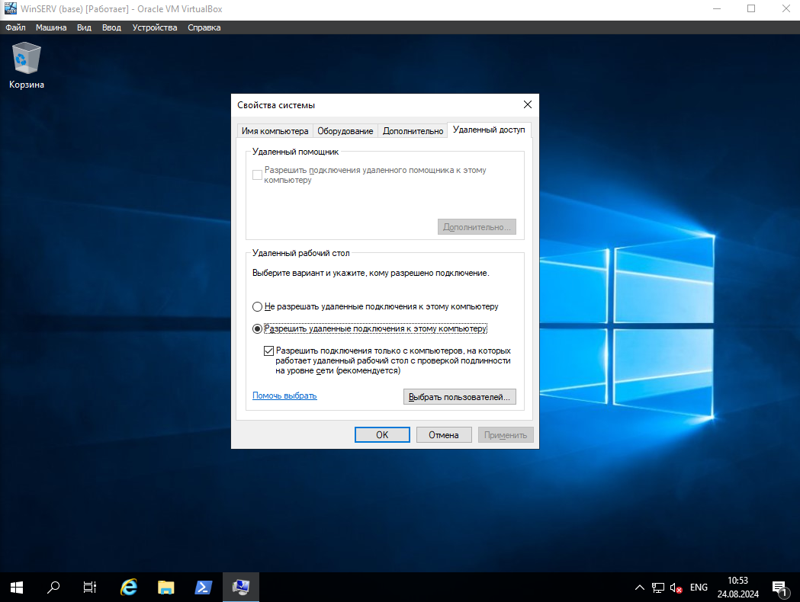
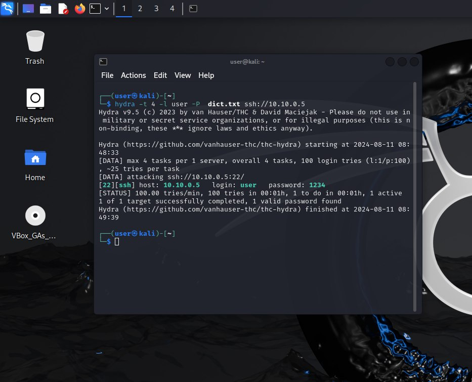
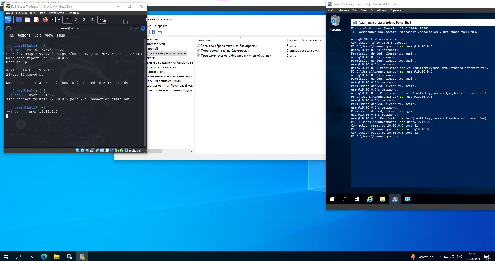

# Homework

- [x] На VM Win10/WinServer установить SSH Server и запустить его.
- [x] Разрешить подключение по RDP.
      
- [x] Провести сканирование подсети с ВМ Kali
- [x] Провести BruteForce (ssh) пароля от ВМ Win10
      

### Задачи со "звездочкой"

- [x] На FireWall Win10 разрешить подключение по SSH только с VM WinServer.
- [x] Настроить в политиках блокировки УЗ блокировку на 5 мин после 7 не удачных попыток.
      
