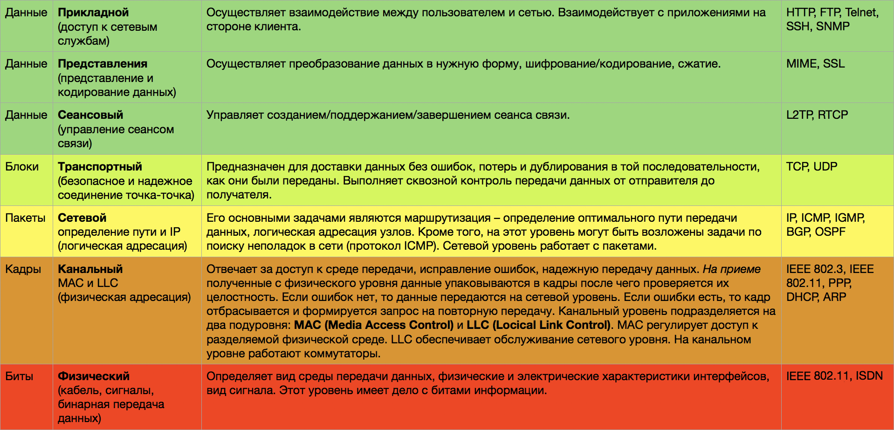

# Homework

- [x] Выложить свои ДЗ в виде проекта Github
- [x] Оформить используя README.md best practise

---

- [x] Проработать и изучить модель OSI.

  - [x] Взять готовую модель OSI, сделать шпаргалку для закрепления
  - [x] Дополнить каждый уровень примерами протоколов (минимум 3)
  - [x] Дополнить примерами атак на различные уровни OSI
  - [x] Изучить описание данных протоколов и принципов работы

    

    
 Сети 

    <h3>Модель OSI</h3>

    

    

    <h3>Типы DDoS-атак</h3>

    <h4>Низкоуровневые атаки:</h4>

    

    • Атаки на <b>сетевом уровне OSI</b> представляют из себя «забивание» канала. Примером может быть CMP-флуд — атака, которая использует ICMP-сообщения, которые снижают пропускную способность атакуемой сети и перегружают брандмауэр. Хост постоянно «пингуется» нарушителями, вынуждая его отвечать на ping-запросы. Когда их приходит значительное количество, пропускной способности сети не хватает и ответы на запросы приходят со значительной задержкой. Для предотвращения таких DDoS-атак можно отключить обработку ICMP-запросов посредством Firewall или ограничить их количество, пропускаемое на сервер.

    • Атаки <b>транспортного уровня</b> выглядят как нарушение функционирования и перехват трафика. Например, SYN-флуд или Smurf-атака (атака ICMP-запросами с изменёнными адресами). Последствия такой DDoS-атаки — превышение количества доступных подключений и перебои в работе сетевого оборудования.
    

    <h4>Высокоуровневые атаки:</h4>

    

    • На <b>сеансовом уровне</b> атакам подвергается сетевое оборудование. Используя уязвимости программного обеспечения Telnet-сервера на свитче, злоумышленники могут заблокировать возможность управления свитчем для администратора. Чтоб избежать подобных видов атак, рекомендуется поддерживать прошивки оборудования в актуальном состоянии.

    • Высокоуровневые атаки <b>прикладного уровня</b> ориентированы на стирание памяти или информации с диска, «воровство» ресурсов у сервера, извлечение и использование данных из БД. Это может привести к тотальной нехватке ресурсов для выполнения простейших операций на оборудовании. Наиболее эффективный способ предупреждения атак – своевременный мониторинг состояния системы и программного обеспечения.

    

---

- [x] IPv4, IPv6

  - [x] Расписать из сети 192.168.0.0/25 все подсети с /26 по /30 (не используя калькулятор)
    

      
 Сети 

      

        
      <h3>192.168.0.0/25</h3>
      расписал маску в битах
      1111111 11111111 11111111 10000000

    получаем маску 255.255.255.128

    следовательно по 25 маске у нас 126 хостов, 127 (broadcast)
    192.168.0.1-127

      <h3>Подсети:</h3>
      <h3>192.168.0.0/26</h3>
      1111111 11111111 11111111 11000000
      маска 255.255.255.192

    1 подсеть:
    адрес 192.168.0.0/26
    хосты 192.168.0.1-62
    63 (broadcast)

    2 подсеть
    адрес 192.168.0.64/26
    хосты 192.168.0.65-126
    127(broadcast)

      <h3>192.168.0.0/27</h3>
      11111111 11111111 11111111 11100000
      маска 255.255.255.224

    1 подсеть
    адрес 192.168.0.0/27
    хосты 192.168.0.1-30
    31 (broadcast)

    2 подсеть
    адрес 192.168.0.32/27
    хосты 192.168.0.33-62
    63 (broadcast)

    3 подсеть
    адрес 192.168.0.64/27
    хосты 192.168.0.65-94
    95 (broadcast)

    4 подсеть
    адрес 192.168.0.96/27
    хосты 192.168.0.97-126
    127 (broadcast)

      <h3>192.168.0.0/28</h3>
      11111111 11111111 11111111 11110000
      маска 255.255.255.240

    1 подсеть
    адрес 192.168.0.0/28
    хосты 192.168.0.1-14
    15 (broadcast)

    2 подсеть
    адрес 192.168.0.16/28
    хосты 192.168.0.16-30
    31 (broadcast)

    3 подсеть
    адрес 192.168.0.32/28
    хосты 192.168.0.33-46
    47 (broadcast)

    4 подсеть
    адрес 192.168.0.48/28
    хосты 192.168.0.49-62
    63 (broadcast)

    5 подсеть
    адрес 192.168.0.64/28
    хосты 192.168.0.65-78
    79 (broadcast)

    6 подсеть
    адрес 192.168.0.80/28
    хосты 192.168.0.81-94
    95 (broadcast)

    7 подсеть
    адрес 192.168.0.96/28
    хосты 192.168.0.97-110
    111 (broadcast)

    8 подсеть
    адрес 192.168.0.112/28
    хосты 192.168.0.113-126
    127 (broadcast)

      <h3>192.168.0.0/29</h3>
      11111111 11111111 11111111 11111000
      маска 255.255.255.248

    1 подсеть
    адрес 192.168.0.0/29
    хосты 192.168.0.1-6
    7 (broadcast)

    2 подсеть
    адрес 192.168.0.8/29
    хосты 192.168.0.9-14
    15 (broadcast)

    3 подсеть
    адрес 192.168.0.16/29
    хосты 192.168.0.17-22
    23 (broadcast)

    4 подсеть
    адрес 192.168.0.24/29
    хосты 192.168.0.25-30
    31 (broadcast)

    5 подсеть
    адрес 192.168.0.32/29
    хосты 192.168.0.33-38
    39 (broadcast)

    6 подсеть
    адрес 192.168.0.40/29
    хосты 192.168.0.41-46
    47 (broadcast)

    7 подсеть
    адрес 192.168.0.48/29
    хосты 192.168.0.49-54
    55 (broadcast)

    8 подсеть
    адрес 192.168.0.56/29
    хосты 192.168.0.57-62
    63 (broadcast)

    9 подсеть
    адрес 192.168.0.64/29
    хосты 192.168.0.65-70
    71 (broadcast)

    10 подсеть
    адрес 192.168.0.72/29
    хосты 192.168.0.73-78
    79 (broadcast)

    11 подсеть
    адрес 192.168.0.80/29
    хосты 192.168.0.81-86
    87 (broadcast)

    12 подсеть
    адрес 192.168.0.88/29
    хосты 192.168.0.89-94
    95 (broadcast)

    13 подсеть
    адрес 192.168.0.96/29
    хосты 192.168.0.97-102
    103 (broadcast)

    14 подсеть
    адрес 192.168.0.104/29
    хосты 192.168.0.105-110
    111 (broadcast)

    15 подсеть
    адрес 192.168.0.112/29
    хосты 192.168.0.113-118
    119 (broadcast)

    16 подсеть
    адрес 192.168.0.120/29
    хосты 192.168.0.121-126
    127 (broadcast)

      <h3>192.168.0.0/30</h3>
      11111111 11111111 11111111 11111100
      маска 255.255.255.252

    С такой маской будет 4 ip-адреса в каждой подсети
    1 - под адрес
    2-3 - под хосты
    4 - широковещательный

    всего получится 32 подсети

    1 подсеть
    адрес 192.168.0.0/30
    хосты 192.168.0.1-2
    3 (broadcast)

    2 подсеть
    адрес 192.168.0.4/30
    хосты 192.168.0.5-6
    7 (broadcast)

    …..

    32 подсеть
    адрес 192.168.0.124/30
    хосты 192.168.0.125-126
    127 (broadcast)
      

    

  - [x] Cконвертировать 3 ip адреса 192.168.100.1, 172.16.0.1, 10.10.10.10 в IPv6
      

      
 Конвертация 

    Для конвертации IPv4 адресов в IPv6 можно использовать уникальные локальные адреса (ULAs), которые предназначены для локальной связи и аналогичны частным адресам IPv4. Вот как будут выглядеть IP-адреса в формате IPv6:

    <b>192.168.100.1</b>
    Конвертируется в: <code>fc00::c0a8:6401</code>
    Здесь c0a8:6401 — это шестнадцатеричное представление IPv4 адреса.

    <b>172.16.0.1</b>
    Конвертируется в: <code>fc00::ac10:1</code>
    В этом случае ac10:1 — это шестнадцатеричное представление IPv4 адреса.

    <b>10.10.10.10</b>
    Конвертируется в: <code>fc00::a0a:a</code>
    Здесь a0a:a — это шестнадцатеричное представление IPv4 адреса.

    <i><b>Примечания</b>
    ULAs (Unique Local Addresses) начинаются с префикса <code>fc00::/7</code>, что делает их подходящими для использования в частных сетях, аналогично частным IPv4 адресам, таким как 192.168.x.x, 172.16.x.x и 10.x.x.x.
    Эти адреса не маршрутизируются в глобальной сети, что делает их безопасными для использования в локальных сетях.</i>
      

  - [x] Ознакомиться с технологией NAT
        [Технология NAT](<https://ru.wikipedia.org/wiki/NAT#:~:text=NAT%20(%D0%BE%D1%82%20%D0%B0%D0%BD%D0%B3%D0%BB.,Masquerading%20%D0%B8%20Native%20Address%20Translation)>)
