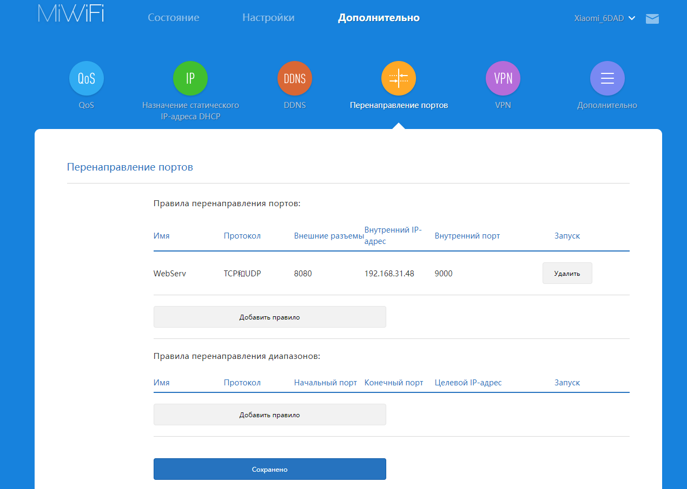
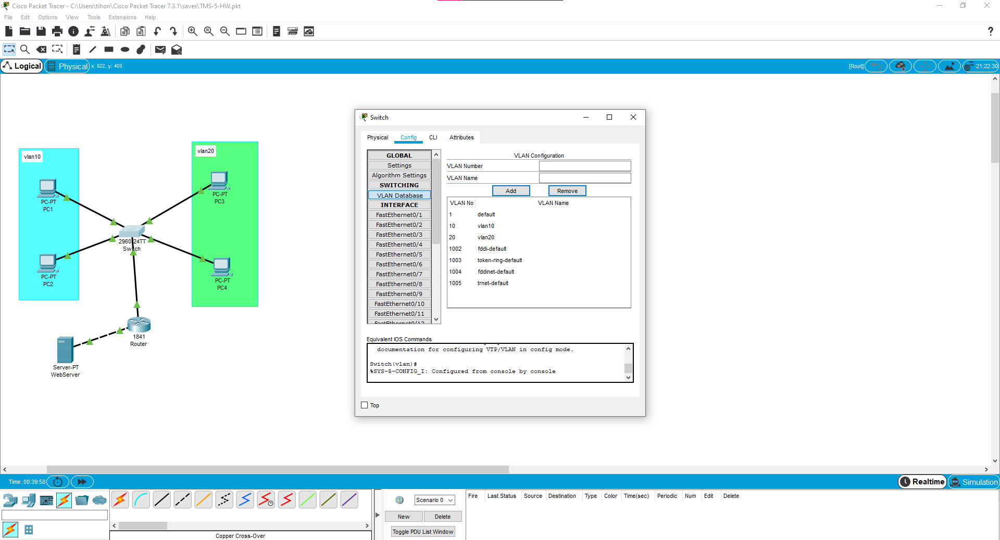
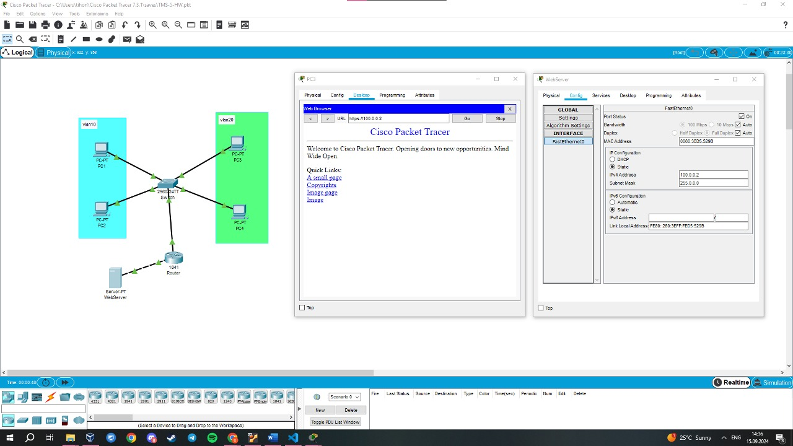

# Homework

- [x] Изучить конфигурацию роутера.

  - [x] Зайти в настройки домашнего роутера
  - [x] Изучить настройки, сделать скрины настройки проброса портов приложений (на примере если бы вы хотели открыть доступ к домашнему веб-серверу)

  
 Настройки роутера для подключения к веб-серверу. 

    
  
  

---

- [x] Работа с Cisco Packet Tracer.

  - [x] Собрать базовую схему комп-свитч-роутер-свитч-комп
  - [x] Сегментировать сеть на 10 и 20 vlan, добиться видимости хостов
  - [x] Настроить сеть, добиться echo ping запросов между хостами
  - [x] Проследить на симуляции за пакетом ICMP

  

    
 Работа с Cisco Packet Tracer 

      
    

  

---

- [x] На 1 из сторон заменить хост на сервер, настроить на сервере web страничку, настроить NAT на роутере, добиться доступа по NAT inside global адресу к web серверу

  

    
 Настрой веб-сервера 

  

  

