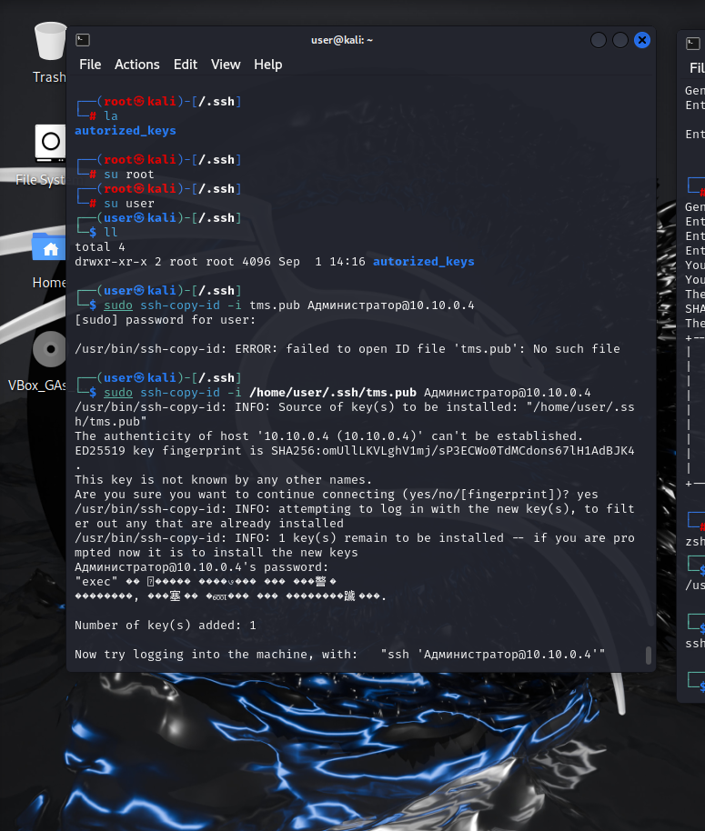
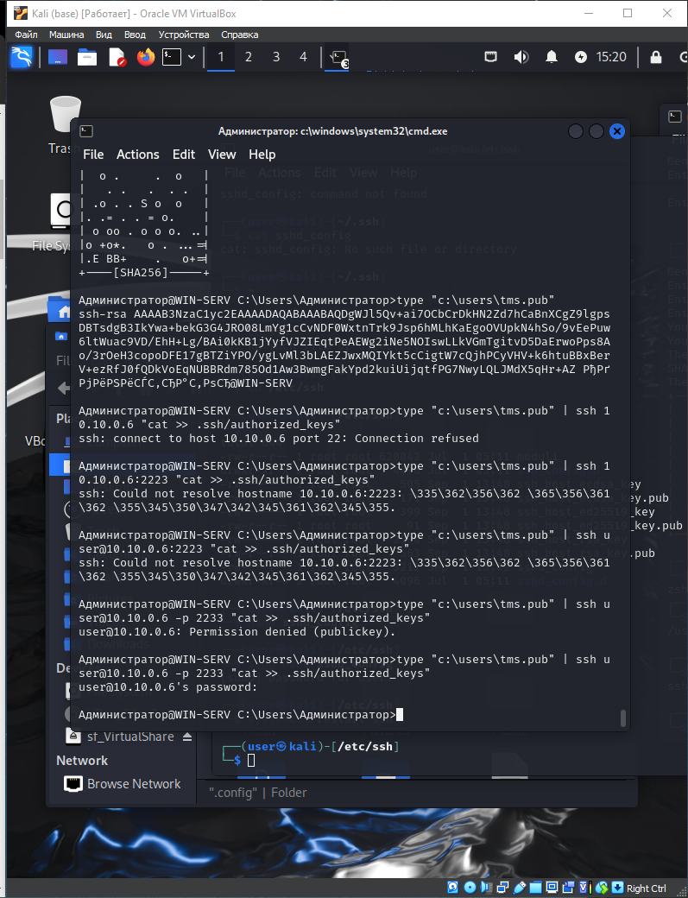
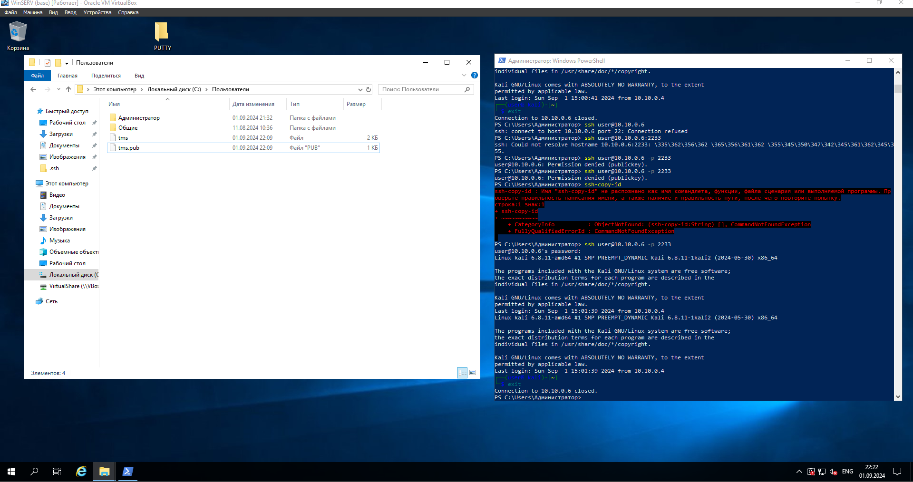
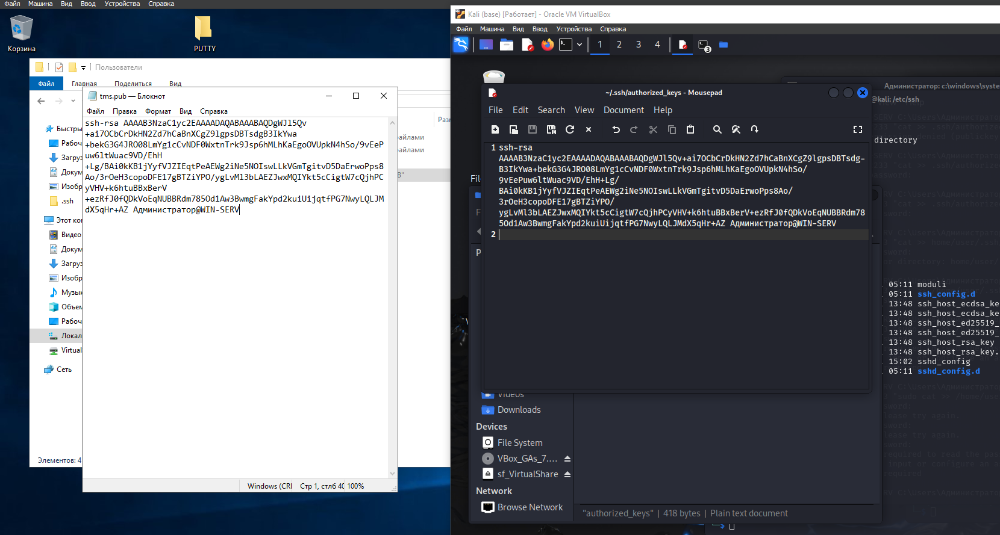

# Homework

- [x] Изучить этапы, методы и протоколы IPSec фреймворка.
  - [x] IKE Phase 1
  - [x] IKE Phase 2
  - [x] IPSec framework protocols
  - [x] HTTP vs HTTPS
  - [x] SSH Best Practice.

---

- [x] На VM Uubuntu настроить SSH по лучшим практикам
- [x]     Сгенерировать на Windows host либо Kali linux VM (ssh-keygen) приватный и публичный ключ, добавить ключ (замок) ssh-add либо scp на ubuntu VM где настроили ssh
- [x] Подключиться к ubuntu VM используя приватный ключ

  

    
 Настройки и подключение по SSH

      
    
    
    
    
    
  

---
- [ ]  WireGuard VPN.
  - [ ] Развернуть Ubuntu с двумя сетевыми интерфейсами. Один - в интернет, другой - во внутреннюю сеть, к которой у вас подключены WS и Kali. Настроить на ней возможность подключения по RDP и SSH c WS. Срок - неделя. 
  - [ ] Установить и настроить WireGuard VPN на Ubuntu
  - [ ] Установить агент VPN Wireguard на хостовую машину 
  - [ ] Установить VPN соединение между хостовой машиной и Ubuntu с VPN Wireguard
