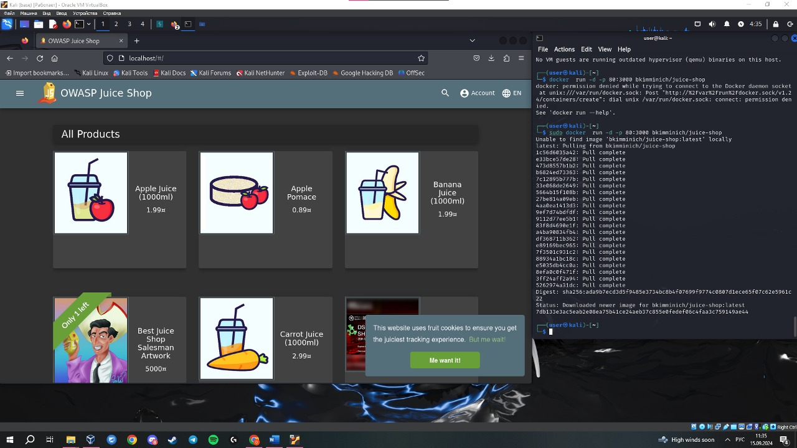

# Homework

- [x] Изучить SQL запросы.

  - [x] Пройти как можно больше заданий в SQLBOLT

SQLBolt

---

- [x] Лабораторные работы по OWASP TOP 10.

  - [x] Выполнить 2 лабораторные работы из практики Brocken Access Control
  - [x] Lab Broken Access Controll 1
  - [x] Lab Broken Access Controll_2

- [x] Выполнить 1 лабораторную работу из практики Injections

  - [x] Lab Injection 1
  - [x] Выполнить 1 лабораторную работу из практики Server-Side Request Forgery
  - [x] Lab SSRF 1

Лабы из WebSecurityAcademy

---

- [x] Тренировка поиска уязвимостей на примере OWASP Juice Shop

Лабы из Juice Shoip

