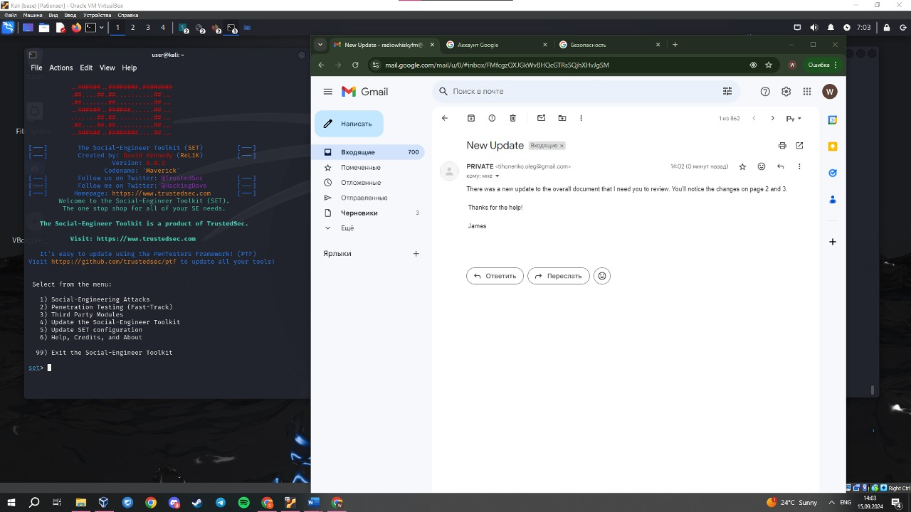

# Homework

- [x] Разослать фишинговое письмо с уникальной информацией, ведущее на копию крупного ресурса (соцсети, почты и т.д.)

  - [x] Установить setoolkit на Ubuntu VM
  - [x] Сделать фишинговое письмо с копией распространенного сервиса
  - [ ] Сделать скрины сервиса и перехвата данных авторизации
  - [ ] \*Сделать все это на виртуальной машине в облаке, с привязкой к реальному “поддельному” домену

Фишинг

